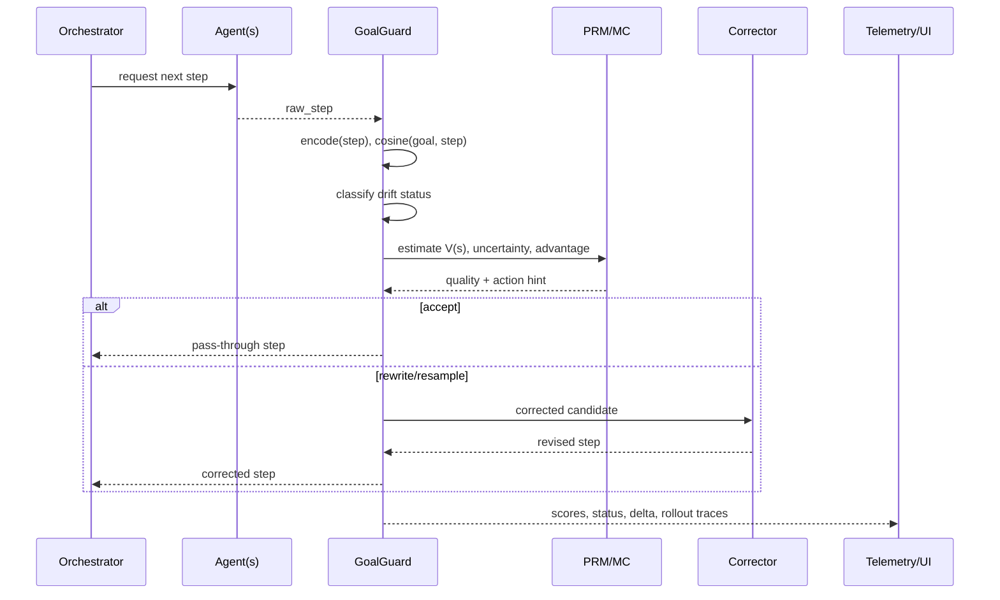

# GoalGuard: Infrastructure Layer for Multi-Agent Orchestration

GoalGuard is not just another prompt wrapper. It is a control-and-observability infrastructure layer that sits between agent orchestration and model execution, enforcing goal adherence with explicit math-driven checks and interventions.

This repo contains a runnable reference implementation (SDK + Streamlit) that demonstrates how a GoalGuard layer can supervise agent trajectories and apply corrective policy when drift emerges.

---

## Core Positioning

Most "goal orienting" systems stop at prompting, retrieval, or static constraints. GoalGuard adds a runtime control plane:

- it scores each produced step against a goal representation,
- classifies drift severity,
- estimates downstream success with pseudo-PRM Monte Carlo rollouts,
- decides control actions (`accept`, `rewrite`, `resample`),
- and tracks trajectory metrics for live observability.

In short: **GoalGuard is an infra control loop for multi-agent pipelines, not only a prompt strategy.**

---

## Architecture (Infra Framing)

```mermaid
flowchart TD
    O[Orchestrator / Multi-Agent Runtime] -->|candidate step| G[GoalGuard Layer]
    G --> E[Embedding + Alignment Math]
    E --> D[Drift Gate]
    D --> P[PRM + Monte Carlo Value Layer]
    P --> C[Control Policy]
    C -->|accept| A[Agent Output Stream]
    C -->|rewrite/resample| I[Intervention Engine]
    I --> A
    A --> T[Telemetry + Dashboard]
    T --> O

    subgraph GG[GoalGuard Layer (Math Stack)]
      E
      D
      P
      C
    end
```

---

## GoalGuard Math Stack (Detailed Chart)

| Math layer | File(s) | Primary equation / mechanism | Runtime role | Control impact |
|---|---|---|---|---|
| Semantic alignment | `goalguard/alignment.py` | cosine similarity between goal embedding and step embedding | Produces alignment score in `[-1, 1]` | Feeds drift gate and PRM quality |
| Goal-trajectory projection | `goalguard/alignment.py` | unit-vector projection + `x_offtopic = sqrt(1 - y^2)` | Produces geometric coordinates `(x_offtopic, y_toward_goal)` | Telemetry + correction vectors |
| Drift gate | `goalguard/drift.py` | threshold classification (`aligned`, `drifting`, `off_goal`) | Converts score into operational state | Triggers correction path |
| Corrective intervention | `goalguard/intervention.py`, `goalguard/agent.py` | deterministic or LLM rewrite conditioned on drift severity | Generates corrected step candidate | Directly changes next emitted step |
| Pseudo-PRM value estimation | `goalguard/prm.py` | Monte Carlo rollouts over stochastic continuation dynamics | Estimates `V(s)` and uncertainty | Informs action choice confidence |
| Step quality fusion | `goalguard/prm.py` | `quality = 0.45*semantic_progress + 0.55*value_estimate` | Blends immediate alignment and future viability | Used in action policy and best-of-N ranking |
| Advantage-based control | `goalguard/simulator.py`, `goalguard/prm.py` | `advantage = V_t - V_{t-1}` + threshold rules | Decides `accept` / `rewrite` / `resample` | Governs intervention frequency |
| Candidate reranking (best-of-N) | `goalguard/simulator.py` | score each candidate via PRM quality | Selects highest quality candidate | Enables stronger guarded lane |
| Ising-style phase observability | `app.py` | 2D spin lattice + Metropolis sweeps (`T`, `h`, `J`) | Visualizes rollout phase behavior | Observability only (not yet policy input) |

---

## End-to-End Step Lifecycle



---

## Why This Is Different

### 1) Runtime control, not just prompting
Goal adherence is continuously measured per step and can trigger immediate policy changes.

### 2) Coupled present + future objective
The policy does not rely only on current similarity score; it combines semantic fit with projected downstream success (`V(s)`).

### 3) Explicit advantage gating
Control actions are tied to value improvement/degradation, not only static thresholds.

### 4) Multi-agent infra compatibility
GoalGuard can supervise outputs from one agent or many agents because it sits as a middleware layer between orchestration and emission.

### 5) Full observability surface
Trajectory geometry, delta trends, rollout distributions, and phase visuals provide debugging and governance signals.

---

## Simulation Modes

| Mode | What changes | Best use |
|---|---|---|
| `fair_replay` | Same base steps for unguarded and guarded lanes | apples-to-apples baseline comparison |
| `steering` | Guarded corrections feed forward into future context | demonstrate closed-loop intervention |
| `prm_mc` | PRM value/advantage gates rewrite behavior | show policy control from Monte Carlo signals |
| `prm_best_of_n` | Generate candidate set and rerank with PRM quality | show action selection under alternatives |

---

## Project Layout

- `goalguard/agent.py` - guarded wrapper (`GoalGuard`) and correction application
- `goalguard/config.py` - runtime config loader
- `goalguard/encoders.py` - demo + Gemini embedding backends
- `goalguard/types.py` - shared event schema
- `goalguard/alignment.py` - similarity and semantic coordinate math
- `goalguard/drift.py` - drift detection/status classification
- `goalguard/intervention.py` - correction policies (`demo` and Gemini)
- `goalguard/prm.py` - pseudo-PRM scoring and Monte Carlo value estimation
- `goalguard/real_agent.py` - Gemini structured-output step generator
- `goalguard/simulator.py` - synchronized two-lane execution + PRM orchestration
- `demo_agent.py` - deterministic baseline generator + placeholder embeddings
- `app.py` - live dashboard and Ising-style observability widgets
- `config.json` - default runtime settings

---

## Setup

```bash
python -m venv .venv
source .venv/bin/activate
pip install -r requirements.txt
```

Create `.env` in project root:

```bash
GEMINI_API_KEY=your_key_here
```

## Run

```bash
streamlit run app.py
```

---

## Current State of Ising Layer

The Ising/Metropolis layer is implemented in `app.py` as an observability model:

- it maps rollout outcomes into spins,
- evolves the lattice with Metropolis sweeps,
- and renders phase-like diagnostics.

Today it is **not** used to choose `accept/rewrite/resample`. If desired, the next iteration can feed lattice-derived signals (for example magnetization or phase instability) into PRM action thresholds.
